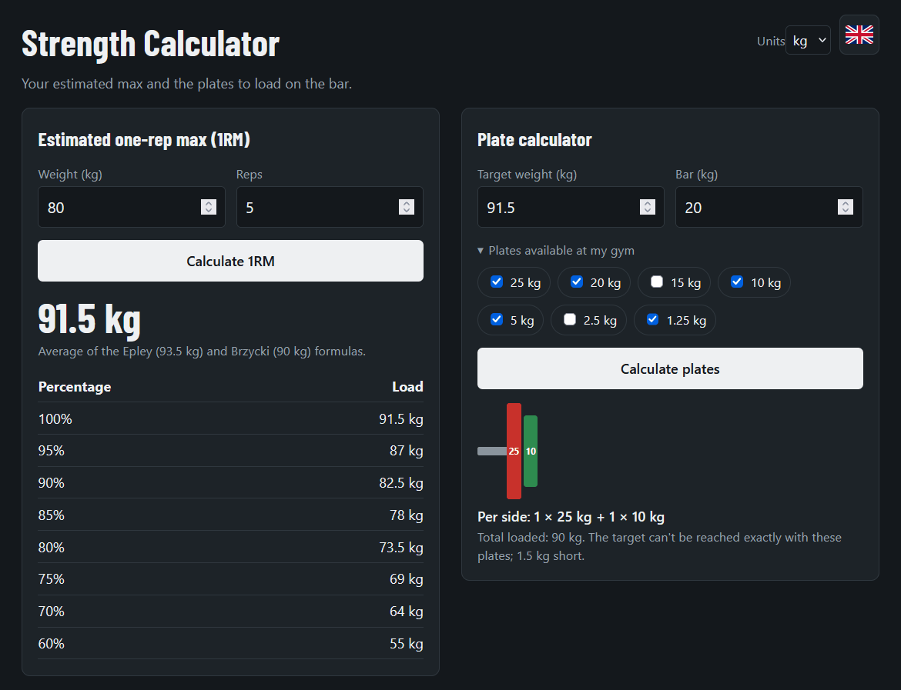
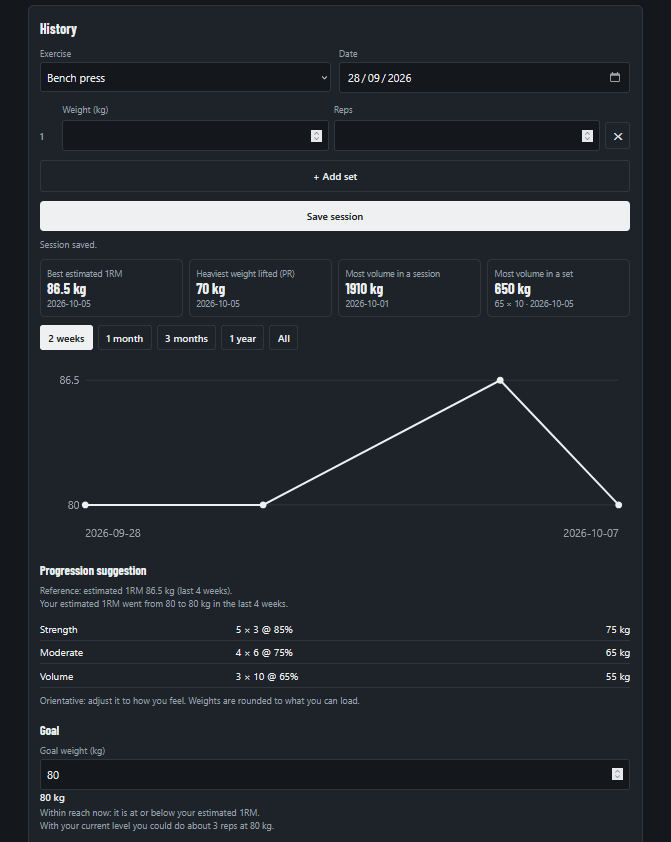
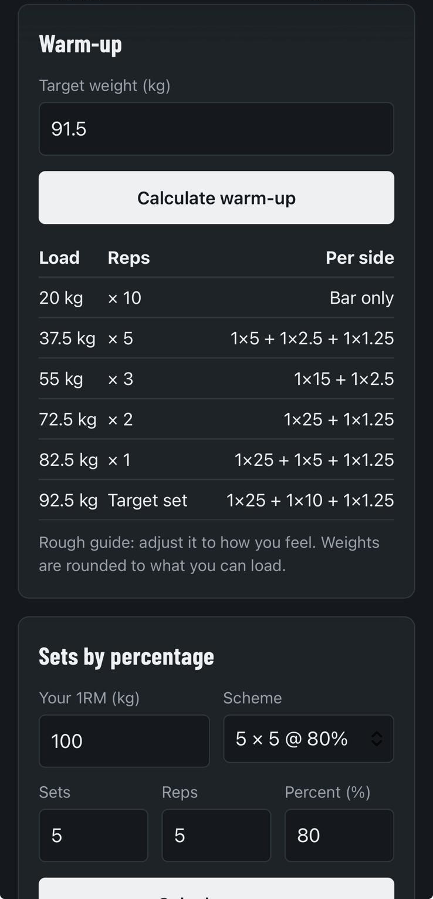

# Strength Calculator

A small web tool for lifters: estimate your max, load the bar, warm up, plan sets and track your progress. It runs entirely in your browser, with no accounts and nothing to install.

**Try it:** https://airizar00.github.io/Strength-Calculator/

  

  
  &nbsp;&nbsp;&nbsp;
  

Calculators &nbsp;·&nbsp; History and records &nbsp;·&nbsp; On your phone

## Features

- **1RM estimator**: enter a weight and reps to get your estimated one-rep max and a table of working percentages (average of the Epley and Brzycki formulas).
- **Plate calculator**: see which plates to load on each side of the bar, using only the plates your gym has.
- **Warm-up**: a rough warm-up ramp towards your target weight, rounded to the plates you can load.
- **Sets by percentage**: pick a scheme (e.g. 5 × 5 @ 80%) and get the exact load and plates. Unrealistic combinations are flagged.
- **History**: log sessions per exercise, with several sets that each have their own weight and reps. Add your own exercises.
- **Progress**: chart of your estimated 1RM with a period filter, personal records (best estimated 1RM, heaviest weight lifted, most volume in a session and in a set), a next-session suggestion based on your last weeks, and goals with a rough check of how realistic they are.
- **Rest timer**: countdown with quick presets (1:00 to 5:00) or a custom time, with sound and vibration when it ends.
- **English / Spanish**, **kg / lb**, light and dark mode.
- **Installable and offline**: add it to your home screen and it keeps working without a connection after the first visit.

## Your data

Everything is stored in your own browser, on your own device. Nothing is sent anywhere. Use **Export backup** in the History section to keep a copy or to move your data to another device.

## Run it locally

Open `index.html` in your browser. The offline mode needs the hosted (https) version.

## Notes

- 1RM values are estimates and are most accurate for sets of 12 reps or fewer.
- Warm-ups, suggestions and goal checks are general guides, not personalised training or medical advice.

## License

See the [LICENSE](LICENSE) file.
